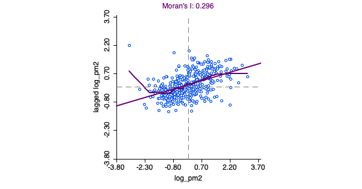

```{r setup, include=FALSE}
options(htmltools.dir.version = FALSE)
knitr::opts_chunk$set(
  fig.width=9, fig.height=3.5, fig.retina=3,
  out.width = "100%",
  cache = FALSE,
  echo = TRUE,
  message = FALSE, 
  warning = FALSE,
  fig.show = TRUE,
  hiline = TRUE
)

suppressPackageStartupMessages({
  library(tidyverse)
  library(RefManageR)
  library(xaringanthemer)
  library(xaringanExtra)
  library(ggplot2)
  library(maps)
  library(mapproj)
  library(tmap)
  library(rmapshaper)
  library(sf)
  library(spData)
  library(spDataLarge)
  library(stars)
  library(mapview)
  library(rgdal)
  library(rgeos)
  library(rnaturalearth)
  library(rnaturalearthhires)
  library(plotly)
  library(imageclipr)
})
```

```{r xaringan-themer, include=FALSE, warning=FALSE}
style_duo_accent(
  primary_color = "#054356",
  secondary_color = "#1bafb9",
  inverse_header_color = "#f9de45"
)
```

```{r hvl-logo, echo=FALSE}
xaringanExtra::use_logo(
  image_url = "hvl_logo_engelsk.jpg",
  width = "165px",
  height = "192px"
)
xaringanExtra::use_tile_view()
```

```{r, load_refs, include=FALSE, cache=FALSE}
BibOptions(check.entries = FALSE,
           bib.style = "authoryear",
           cite.style = "alphabetic",
           style = "markdown",
           hyperlink = FALSE,
           dashed = FALSE)
myBib <- ReadBib("../met2refs.bib", check = FALSE)
```

---

# We will do EDA in GeoDa


.pull-left[
- Collect what we do in a project
- Start with a new empty project
- We can also open a previously saved project
]
.pull-right[

]

---

# Add our map

.pull-left[
- Add our map


]
.pull-right[

- we have our map loaded


]
---

# Generate weights matrix

.pull-left[
- we have to denote our neighbours


]
.pull-right[
## Weights manager


- We use knr as id variable
- Use **contiguity**, Queen or Rook
- Precision threshold might help if there is topological problems
- The map is projected UTM N33, unit is meter
- Our threshold 0.5 meter
- Create and then Close
]
---

# Weights manager cont.

.pull-left[

]
.pull-right[
- We have our weights
- Make symmetric
- Important that min neighbours > 0, else problems
]

---

# Weights manager cont.

.pull-left[

- Connectivity Map


- hoover over a municipality and the neighbours will be shown
- Haugesund: Sveio, Tysvær, Karmøy and **Bømlo**
]
.pull-right[

- Connectivity Graph


- another way to illustrate neighbours
]

---

# Do we have spatial autocorrelation in our data?

.pull-left[

## Global analysis

- we analyse spatial autocorrelation for the whole data set (have we got it?)

## Local analysis

- we try to locate clusters of spatial autocorrelation (where is it?)

]
.pull-right[

]

---

# Select variable and weights

 Documentation is to be found at [https://geodacenter.github.io/workbook/5a_global_auto/lab5a.html](https://geodacenter.github.io/workbook/5a_global_auto/lab5a.html). Most of the following is taken from this source,

.pull-left[
- We select log_pm2 as variable and the queen based contiguity weights


]
.pull-right[
- Moran's I

$$I = \frac{\sum_i \sum_j w_{ij} · z_i · z_j/S_0}{\sum_i z_i^2/n}$$
der $z_i=x_i -\bar{x}$, $S_0=\sum_i \sum_j w_{ij}$ and $n$ the number of observations.
- remember that the weights are 0 for the ones that are not a neighbour
]

---

# Options for Global Morans I

.pull-left[


]
.pull-right[
- Right click/ctrl click on plot
- Click Randomisation
- Choose 999 Permutations

## Interpretation

- Distribution of 999 randomisations (the values of log_pm2 are randomly appoint to different municipalities)
- The vertical line is the mean I from the randomisation (-0,0026)
- The green vertical line is I for our data 0,2961
- Our I lies far to the right of the distribution
- Evidence of positive spatial autocorrelation in our data
]

---

# Other options

.pull-left[

]
.pull-right[
- LOWESS smoother
- Regimes regression 
    + Morans I for selected/not selected
]

---

# The "killer" feature in GeoDa; linked plots

.center[

]

---

# Spatial Correlogram

.pull-left[
- standardised variables (mu=0, sd=1)
- $z_i · z_j = f(d_{ij}) + u$
- $d_{ij}$, distance between "center" of $i$ polygon and $j$ polygon
- The smoothed line on the top shows how auto-correlation depends upon distance between to places. The bar shows how many obs. we have for each distance
- Distance in meter, so max. dist. in figure is 70 km (ca. 1,5 hours of commute time)
]
.pull-right[

]

---

# Local Spatial Autocorrelation

.pull-left[
## Lets hunt clusters


]
.pull-right[
- LISA, Local Indicator of Spatial Association (Anselin 1995)
- Local Morans I
- Global analysis: "Do we have spatial autocorrelation?"
- Local analysis: "**Where** is the spatial autocorrelation located?"
- Where should we expect clusters in our data?
]

---

LISA
.center[

]
---

# LISA Cluster Map

.pull-left[

]
.pull-right[
## LISA

- High-High: this muni is high and its neighbouring munis are high
- Low-Low: this muni is low and its neighbouring munis are low
- Low-High; this muni is low, but its neighbours are high
- High-Low; this muni is high, but its munis are low
- Can this be connected with infrastructure?
- Note when High-High is clicked in the top map. The High-High munis are selected in both figures
]

---

## Significance

.pull-left[

]
.pul-right[
- Global Morans I: $I = \frac{\sum_i\sum_j w_{ij}·z_i·z_j}{\sum_i z_i^2}$
- Local Morans I: $I_i = \frac{\sum_j w_{ij}·z_i·z_j}{\sum_i z_i^2}$
- The global Morans I corresponds with the average of the local Morans I (details Anselin 1995)
- Significance: analytic or conditional permutations
- Analytical not very reliable in practice (Anselin 1995)
- Conditional permutations: For each obs. (here muni) the local value is kept constant (log_pm2 for this muni) while the remaining n-1 values are randomly permuted. 
- In this way we build a reference distribution
- The real value is then compared to this distribution
- Generate a "pseudo p-value" that can be used to assess significance
]

---

# Other analysis in GeoDa

- Different kinds of plots, univariate, bivariate and multivariate
  - Histogram, boxplot, scatter plot, bubble chart, 3d chart, Parallel Coordinate Plot and Conditional Plots
  - Plots will be linked
  - Tools like brushing, selection of subset etc. is avaialble
  - See documentation, Exploratory Data Analysis (1) and (2)
- Nice for exploring, but it's recommended that the final plots are made in R, with the help of ggplot2, tmap etc., in a reproducible manner
- GeoDa can also do some spatial regression analysis

---

# Spatial regression analysis

.left-column[
- Follows Anselins recommendations
  - classic OLS
  - Spatial lag
  - Spatial error
- No SLX (necessary to follow leSage 2014)
- Do your spatial econometrics in R, with sp/sf
]

.right-column[

]