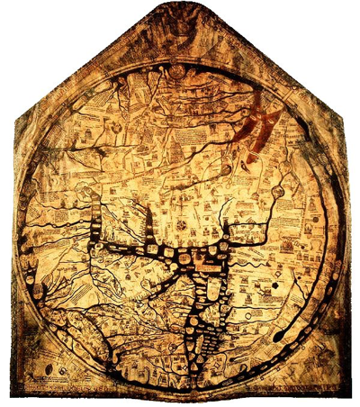
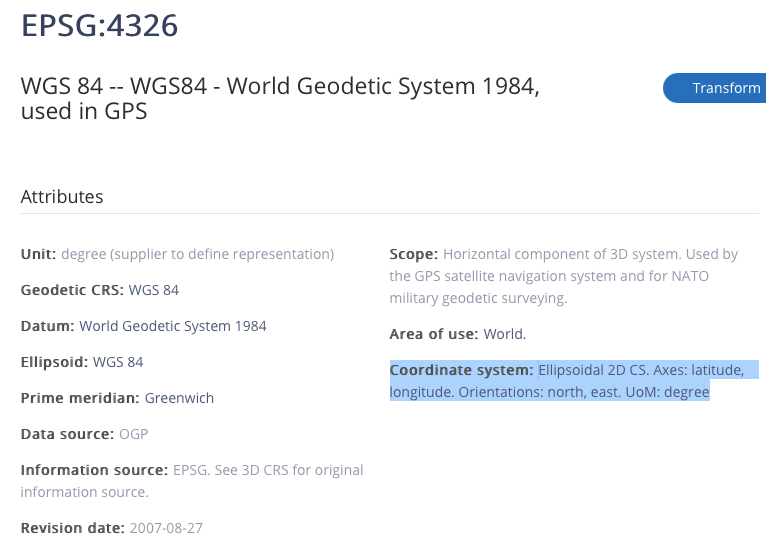
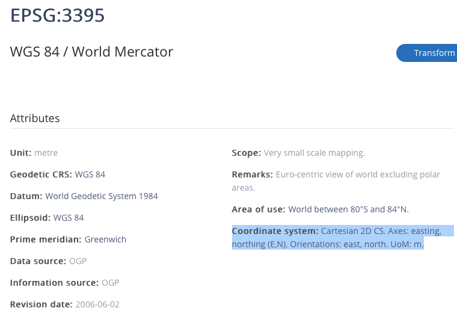
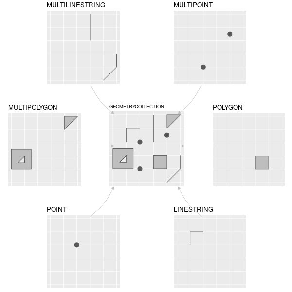

```{r setup, include=FALSE}
options(htmltools.dir.version = FALSE)
knitr::opts_chunk$set(
  fig.width=9, fig.height=3.5, fig.retina=3,
  out.width = "100%",
  cache = FALSE,
  echo = TRUE,
  message = FALSE, 
  warning = FALSE,
  fig.show = TRUE,
  hiline = TRUE
)
suppressPackageStartupMessages({
  library(tidyverse)
  library(RefManageR)
  library(xaringan)
  library(xaringanthemer)
  library(xaringanExtra)
  library(ggplot2)
  library(maps)
  library(mapproj)
  library(tmap)
  library(rmapshaper)
  library(sf)
  library(spData)
  library(spDataLarge)
  library(stars)
  library(mapview)
  library(rgdal)
  library(rgeos)
  library(rnaturalearth)
  library(rnaturalearthhires)
  library(plotly)
  library(imageclipr)
  library(units)
})
```

```{r xaringan-themer, include=FALSE, warning=FALSE}
style_duo_accent(
  primary_color = "#054356",
  secondary_color = "#1bafb9",
  inverse_header_color = "#f9de45"
)
```

```{r hvl-logo, echo=FALSE}
xaringanExtra::use_logo(
  image_url = "hvl_logo_engelsk.jpg",
  width = "165px",
  height = "192px"
)
xaringanExtra::use_tile_view()
xaringanExtra::use_panelset()
```

```{r, load_refs, include=FALSE, cache=FALSE}
BibOptions(check.entries = FALSE,
           bib.style = "authoryear",
           cite.style = "alphabetic",
           style = "markdown",
           hyperlink = FALSE,
           dashed = FALSE)
myBib <- ReadBib("./met2refs.bib", check = FALSE)
```


## Our first map

.panelset[
.panel[.panel-name[Code]

```{r, eval=FALSE}
HgsdOgOmegn <- read_sf("HgsdOgOmegn.gpkg")
HgsdOgOmegn %>% 
  select(knavn) %>% 
  plot(graticule = TRUE, axes = TRUE, key.pos = 1)
```

- We read in a map with `read_sf()`, `select()` the variable __knavn__ and then `plot()` the map. Notice that `plot()` knows how to plot a map!
- When package sf is loaded there exists a function `plot.sf()` that knows how to plot maps. See `?plot.sf` for details.
- The generic `plot()` function calls the right function for the relevant kind of object.
]

.panel[.panel-name[Plot]

```{r, echo=FALSE}
HgsdOgOmegn <- read_sf("HgsdOgOmegn.gpkg")
HgsdOgOmegn %>% 
  select(knavn) %>% 
  plot(graticule = TRUE, axes = TRUE, key.pos = 1)
```
]
]

---

## Our first map cont. (mapview)

- Same map using `mapview()` (java script). From the package `mapview`. Nice for interactive use, perhaps not as well suited for print.

--

- See `?mapview` and section __## S4 method for signature 'sf'__ for details. `Mapview()` can also handle other kinds of map objects.

---

## Our first map cont. (mapview)

.panelset[
.panel[.panel-name[Code]

```{r, eval=FALSE}
HgsdOgOmegn %>% 
  select(knavn) %>% 
  mapview(legend = TRUE, col.regions = sf.colors)
```
]

.panel[.panel-name[Plot]
```{r, echo=FALSE}
HgsdOgOmegn %>% 
  select(knavn) %>% 
  mapview(legend = TRUE, col.regions = sf.colors)
```
]
]

---

## Vector to raster

- We can easily convert from vector to raster (the reverse is more complicated).

--

- Bitmap, pixels, an image. 

--

- `HgsdOgOmegn` was in vector format (i.e. a drawing). Points with lines drawn between the points, and a __fill__ inside a closed polygon.

```{r, eval=FALSE}
HgsdOgOmegn %>% 
  select(knavn) %>% 
  st_rasterize(dx = 0.001) %>% #<<
  plot(col=sf.colors(6), breaks = c(0:6))
```

---

## Vector to raster cont.

```{r, echo=FALSE, cache=TRUE}
HgsdOgOmegn %>% 
  select(knavn) %>%
  st_rasterize(dx = 0.001) %>% 
  plot(col=sf.colors(6), breaks = c(0:6))
```

---

## Mapping with ggplot

We know ggplot from before and it produces nice maps (although perhaps a bit slowly). Later we will also use the package. __tmap__

```{r, eval=FALSE}
HgsdOgOmegn %>% 
  ggplot() + 
  geom_sf(aes(fill = knavn)) #<<
```

---

## Mapping with ggplot cont.

```{r, echo=FALSE, cache=TRUE}
HgsdOgOmegn %>% 
  ggplot() + 
  geom_sf(aes(fill = knavn)) 
```

---

## Perhaps to much detail?

- We can find the size of the object HgsdOgOmegn with `round(object.size(HgsdOgOmegn) / 1024)`: `r round(object.size(HgsdOgOmegn) / 1024)`

--

- `sf` has `st_simplify()` with option preserveTopology = TRUE, `HgsdOgOmegnSimp <- st_simplify(HgsdOgOmegn, preserveTopology = TRUE, dTolerance = 1000)`

--

- `st_simplify()` preserves topology for each feature (polygon), but not between features (polygons).

--

- `ms_simplyfy()` from the __rmapshaper__ package preserves topology between features and is a better alternative.

---

## Simplified map

.panelset[
.panel[.panel-name[Code]

```{r, eval=FALSE}
HgsdOgOmegnSimp <- HgsdOgOmegn %>% 
  select(knavn) %>% 
  # keep_shapes = TRUE else we risk to loose islands
  # keep 5% of the points
  ms_simplify(keep = 0.05, keep_shapes = TRUE) #<<
 
round(object.size(HgsdOgOmegn) / 1024)
round(object.size(HgsdOgOmegnSimp) / 1024)

HgsdOgOmegnSimp %>% 
  ggplot() + 
  geom_sf(aes(fill = knavn))
```
]

.panel[.panel-name[Plot]
```{r, echo=FALSE, cache=TRUE}
HgsdOgOmegnSimp <- HgsdOgOmegn %>% 
  select(knavn) %>% 
  # keep_shapes = TRUE else we risk loosing islands
  ms_simplify(keep = 0.05, keep_shapes = TRUE)

HgsdOgOmegnSimp %>% 
  ggplot() + 
  geom_sf(aes(fill = knavn))
```
]
]

---

## Looking better and much smaller


.panelset[
.panel[.panel-name[Code]

```{r, eval=FALSE}
#size HgsdOgOmegn
round(object.size(HgsdOgOmegn) / 1024)
#size HgsdOgOmegnSimp
round(object.size(HgsdOgOmegnSimp) / 1024)
```
]

.panel[.panel-name[Results]
```{r, echo=FALSE}
#size HgsdOgOmegn
round(object.size(HgsdOgOmegn) / 1024)
#size HgsdOgOmegnSimp
round(object.size(HgsdOgOmegnSimp) / 1024)
```
]
]

---

## The problem with projections

[Projections illustrated](https://youtu.be/kIID5FDi2JQ)

---

## Georaphical coordinates

- Haugesund (wikipedia.org): 59°24′37″N 5°16′32″Ø ?

--

- Shows the position of Haugesund on the globe, in degrees, minutes and seconds

--

- Old idea traceable back to Eratosthenes of Cyrene (276 - 194 BC), Hipparchus of Nicaea (190 - 120 BC), Marinus of Tyre (70 - 130 AD) and finally Claudius Ptolemy (100-170 AD) _Geographia_. _Geographia_ survived in arabic translation and was translated into latin 1406 (_Geographia Claudii Ptolemaei_). 

--

- The first degree is __latitude__, measured north (N) from equator

--

- The second degree is __longitude__, east (E) from the zero meridian (through Greenwich, just east of London). 

---

## Georaphical coordinates cont.


- The position is given in the format geographers prefer, (latitude, longitude)

--

- Programmers/data scientist went for (x,y), hence (longitude, latitude)

--

- Still the source of much confusion

--

- Note that geographical coordinates on paper or screen are also a kind of projection. (Think of a photo of a globe)

--

- Note that the axis have coordinates in decimal degrees (not minutes and seconds)

---

.left-column[

## Ptolemy world map


]
.right-column[


]
---

## Maps in Europe between Ptolemy and the Renaissance?

.pull-left-40[
- T and O maps
- Jerusalem center, Asia up, Europe lower left, Africa lower right
- Hereford mappa mundi, ca. 1300 (from wikipedi.org)
]
.pull-right-60[
.center[

]
]
---

## Haugesund

.pull-left-40[
- Haugesund (wikipedia.org): 59°24′37″N 5°16′32″Ø

.small[
```{r, eval=FALSE}
HgsdOgOmegnSimp %>% 
  filter(knavn=='Haugesund') %>% 
  ggplot() + 
  geom_sf(aes(fill = knavn))
```
]
]
.pull-right-60[
```{r, echo=FALSE}
HgsdOgOmegnSimp %>% 
  filter(knavn=='Haugesund') %>% 
  ggplot() + 
  geom_sf(aes(fill = knavn)) +
  theme(legend.position="none")
```
]
---

## What is "inside" HgsdOgOmegnSimp?

.small[
```{r}
HgsdOgOmegnSimp
```
]

---

## What is "inside" HgsdOgOmegnSimp? cont.

- That was quite clean

--

- Utilises the new list-column technique

--

- The geographical information is in the last column

--

- The geom column is persistent, we have to actively delete it

---

## What is WGS84?

- EPSG:4326 WGS 84 -- WGS84 - World Geodetic System 1984
- Model of the whole planet, used with GPS
- geographical coordinates (eastings, northings etc.)
  - "71° Nord"

From wikipidia.org:

> The World Geodetic System (WGS) is a standard for use in cartography, geodesy, and satellite navigation 
> including GPS. This standard includes the definition of the coordinate system's fundamental and 
> derived constants, the ellipsoidal (normal) Earth Gravitational Model (EGM), a description of the 
> associated World Magnetic Model (WMM), and a current list of local datum transformations.

---

## What is MULTIPOLYGON?

- MULTIPOLYGON is an example of a __simple feature__

--

> Simple Features (officially Simple Feature Access) is a set of standards that specify a common storage 
> and access model of geographic feature made of mostly two-dimensional geometries (point, line, polygon, 
> multi-point, multi-line, etc.) used by geographic information systems. It is formalized by both the 
> Open Geospatial Consortium (OGC) and the International Organization for Standardization (ISO). 
(wikipedia.org)

- __simple__: A 2D geometry is simple if it contains no self-intersection

--

- Supported by __sf__, not by __sp__, postgis (PostgreSQL extension), SpatiaLite (SQLite extension), GDAL etc.

--

Simple features standard did not exist when __sp__ was designed.

---

## Standard projections for Norway

[Standard projections for Norway](https://www.kartverket.no/globalassets/til-lands/euref89_ntm_beskrivelse.pdf)

[https://epsg.io/](https://epsg.io/6172)

> EUREF89 UTM (Universal Transversal Mercator-projeksjon) er i løpet av 1. halvår 2009 innført
> som offisielt datum og projeksjon i alle landets kommuner. Innføringen av EUREF89 har gitt oss 
> et moderne, homogent og nøyaktig geodetisk grunnlag som for de fleste praktiske formål kan ansees
> som feilfritt. (Kilde: https://www.kartverket.no/globalassets/til-lands/euref89_ntm_beskrivelse.pdf)

---

## Standard projections for Norway cont.

- EPSG:5972 ETRS89 / UTM zone 32 + NN2000 height (Sør Norge, Norway - onshore - between 6°E and 12°E.) 
- EPSG:5973 ETRS89 / UTM zone 33 + NN2000 height (East Hedemark, Trøndelag-Troms, Norway - onshore - between 12°E and 18°E.)
- EPSG:5975 ETRS89 / UTM zone 35 + NN2000 height (Finnmark, Norway - onshore - between 24°E and 30°E.)

- EUREF89 er det offisielle geodetiske datumet i Norge. Internasjonalt brukes navnet European Terrestrial Reference System 1989 (ETRS89) om samme datum. (Kilde: https://no.wikipedia.org/wiki/EUREF89)

- ED50: ED50 er ei regional referanseramme (geodetisk datum) som dekker Europa. ED50 har vore tilgjengeleg sidan 1950, og Noregs hovudkartserie i målestokk 1 : 50000, N50 (tidlegare M711) brukte tidlegare denne referanseramma. No blir N50-serien gjeven ut med referanseramme EUREF89. (Kilde: https://www.kartverket.no/til-lands/posisjon/referanserammer-for-noreg)

- NN2000, *vertikalt datum*, offisielt høydesystem for Norge, Sverige og Finland. I nyere kart og publikasjoner er høyde over havet oppgitt i NN2000.Også kjent som normalnull 2000. (Kilde:https://snl.no/NN2000)

---

## Standard projections for Norway cont.

- Geoide er det teoretiske nivået havoverflaten ville ligget hvis vi trekker fra effekter av tidevann, havstrømmer og bølger. Geoiden påvirkes av jordas gravitasjonsfelt, og dette er ikke det samme over alt. Geoiden er et viktig utgangspunkt for høydemålinger. (Kilde: https://snl.no/geoide)

- Et *horisontalt datum* inneholder parametre (størrelse og flattrykning) for en jordellipsoide og dens plassering i forhold til jordkroppen. Det punktet som forankrer koordinatsystemet til jordkroppen kalles fundamentalpunktet. (Kilde:https://snl.no/geodetisk_datum)

---

## Previous Norwegian "standards"

Ask `rgdal`.

```{r, cache=TRUE}
# rgdal knows datums
ngo48 <- make_EPSG() %>% 
  filter(str_detect(note, 'NGO 1948'))
```

```{r, eval=FALSE}
ngo48 %>% 
  select(code, note)

ngo48 %>% 
  select(prj4)

ngo48 %>% 
  select(code, prj_method)
```

---

## Previous Norwegian "standards" cont.

```{r, echo=FALSE}
ngo48 %>% 
  select(code, note)
```

---

## Previous Norwegian "standards" cont.

.tiny[
```{r, echo=FALSE}
ngo48 %>% 
  select(prj4)
```
]

---

## Previous Norwegian "standards" cont.

```{r, echo=FALSE}
ngo48 %>% 
  select(code, prj_method)
```

---

## Previous Norwegian "standards" cont.

- NGO1948 er et nasjonalt norsk geodetisk datum og koordinatsystem, som ble brukt fram til 2009.Fundamentalpunktet er i Observatoriet i Oslo.
- For NGO-48 er det Oslo gamle observatorium som er 0. (http://www.milvang.no/gps/gpsconv/gpsconv.html). 
- Virker som det er litt forvirring rundt dette, SNL viser til Oslo solobservatorium som fundamentalpunktet.

---

## Projected

.pull-left-30[
```{r, cache=TRUE}
pHgsd <- HgsdOgOmegn %>% 
  select(knavn) %>% 
  st_transform(5972) %>% #<<
  ggplot() + 
  geom_sf(aes(fill = knavn))
```
]

.pull-right-70[
```{r, echo = FALSE}
pHgsd
```
]

---

## Norske fylker long/lat WGS 84 EPSG 4326 and projected
.small[
```{r}
Norge_fylke <- read_sf("Norge_fylke.gpkg") %>% 
  #check size
  ms_simplify(keep = 0.001, keep_shapes = TRUE) #<<
p1 <- Norge_fylke %>% 
  select(fnr) %>%
  tm_shape() +
  tm_fill() +
  tm_borders() +
  tm_graticules() +
  tm_layout(title = "EPSG:4326 WGS 84") +
  tm_compass(type = "8star", position = c("left", "top")) +
  tm_scale_bar(breaks = c(0, 100, 200), text.size = 1)
p2 <- Norge_fylke %>% 
  select(fnr) %>%
  st_transform(5972) %>% 
  tm_shape() +
  tm_fill() +
  tm_borders() +
  tm_layout(title = "EPSG:5972\nETRS89 / UTM zone 32 + NN2000 height") +
  tm_compass(type = "8star", position = c("left", "top")) +
  tm_scale_bar(breaks = c(0, 100, 200), text.size = 1)
```
]
---

## Norske kommuner long/lat WGS 84 EPSG 4326 cont.
.small[
```{r}
p3 <- Norge_fylke %>% 
  select(fnr) %>%
  st_transform(5973) %>% 
  tm_shape() +
  tm_fill() +
  tm_borders() +
  tm_layout(title = "EPSG:5973\nETRS89 / UTM zone 33 + NN2000 height") +
  tm_compass(type = "8star", position = c("left", "top")) +
  tm_scale_bar(breaks = c(0, 100, 200), text.size = 1)

p4 <- Norge_fylke %>% 
  select(fnr) %>%
  st_transform(5975) %>% 
  tm_shape() +
  tm_fill() +
  tm_borders() +
  tm_layout(title = "EPSG:5975\n ETRS89 / UTM zone 35 + NN2000 height") +
  tm_compass(type = "8star", position = c("left", "top")) +
  tm_scale_bar(breaks = c(0, 100, 200), text.size = 1)
```
]
---

## Result

```{r}
tmap_arrange(p1, p2, p3,p4)
```

---

## Southern Norway

.small[
```{r}
#Norge_fylke_syd <- read_sf("Norge_fylke.gpkg", 
# query="SELECT * FROM Norge_fylke WHERE navn 
# IN ('Østfold', 'Akershus', 'Oslo', 'Hedmark', 'Oppland', 
# 'Buskerud', 'Vestfold', 'Telemark', 'Aust-Agder', 
# 'Vest-Agder', 'Rogaland', 'Hordaland', 'Sogn og Fjordane', 
# 'Møre og Romsdal', 'Sør-Trøndelag')")
# OR
Norge_fylke_syd <- read_sf("Norge_fylke.gpkg", 
                           query="SELECT * FROM Norge_fylke WHERE navn 
                           NOT IN ('Nord-Trøndelag', 'Nordland', 'Troms', 'Finnmark')") %>% 
  #check size
  ms_simplify(keep = 0.01, keep_shapes = TRUE) #<<
p5 <- Norge_fylke_syd %>% 
  select(fnr) %>%
  tm_shape() +
  tm_fill() +
  tm_borders() +
  tm_graticules() +
  tm_layout(title = "EPSG:4326 WGS 84") +
  tm_compass(type = "8star", position = c("left", "top")) +
  tm_scale_bar(breaks = c(0, 100, 200), text.size = 1)
p6 <- Norge_fylke_syd %>% 
  select(fnr) %>%
  st_transform(5972) %>% 
  tm_shape() +
  tm_fill() +
  tm_borders() +
  tm_layout(title = "EPSG:5972\nETRS89 / UTM zone 32 + NN2000 height") +
  tm_compass(type = "8star", position = c("left", "top")) +
  tm_scale_bar(breaks = c(0, 100, 200), text.size = 1)
```
]

---

## Result

```{r}
tmap_arrange(p5, p6)
```


---

## Calculations Rogaland

- use projected map

```{r}
# Rogaland
Norge_fylke_syd %>% 
  select(fnr) %>%
  filter(fnr=='11') %>% 
  st_transform(5972) %>%
  st_area()
```

---

## Calculations Sør-Norge

```{r}
# Sør-norge
Norge_fylke_syd <- Norge_fylke_syd %>% 
  select(fnr, navn) %>%
  st_transform(5972) %>%
  mutate(area = st_area(.))
```

---

## Calculations Sør-Norge

.small[
```{r}
Norge_fylke_syd
```
]

---

## Calculations Sør-Norge (km^2)

```{r}
# Sør-norge
Norge_fylke_syd <- Norge_fylke_syd %>% 
  select(fnr, navn) %>%
  st_transform(5972) %>%
  # convert to km^2 via units package
  mutate(area_km2 = set_units(st_area(.), km^2))
```

---

## Calculations Sør-Norge (km^2)

.small[
```{r}
Norge_fylke_syd
```
]

---

## Conclusion

- Norway: Use EPSG:4326 (latitude/longitude __or__ longitude/latitude ) for geographical coordinates.

or 

- EPSG:5973 for projected (whole of Norway)

- EPSG:5972 for Southern Norway

Unit is meters.

--

To measure distance or area the map __HAS__ to be projected.

---

## Different projections

```{r, echo=TRUE}
# read in world map from rnatrualearth
# The option returnclass = "sf" gives us an sf object
world_ne <- ne_countries(scale = "medium", returnclass = "sf")
```

```{r, echo=TRUE}
class(world_ne)
```

.tiny[
```{r}
head(world_ne[,1:10])
```
]

---

## The longitude latitude problem

- Geographers prefer latitude first, longitude second

--

- Data scientists and GIS programmer often use longitude first, latitude second

--

- For some projections the axis order __is not__ specified
- For some projections the axis order __is__ specified

---

## Axis order EPSG:4326



- The authorities say latitude first, longitude second

---

## Axis order

```{r}
# Default is FALSE
st_axis_order()
```

- Obey the authorities

```{r}
st_axis_order(authority_compliant = TRUE)
```

- Set it back to default

```{r}
st_axis_order(authority_compliant = FALSE)
```

---

## The crs of world_ne

.tiny[
```{r, echo=TRUE}
st_crs(world_ne)
```
]

---

## Plot our world map with plot.sf, geographical coordinates

```{r}
st_axis_order(authority_compliant = TRUE)
```

```{r, eval = FALSE}
world_ne %>% 
  # Select one of the features (variables)
  select(gu_a3) %>%
  # plot with plot.sf
  plot()
```

---

## Plot our world map with plot.sf, geographical coordinates

```{r, echo = FALSE}
world_ne %>% 
  # Select one of the features (variables)
  select(gu_a3) %>%
  # plot with plot.sf
  plot()
```

---

## Plot our world map with ggplot, geographical coordinates

```{r, eval=FALSE}
world_ne %>% 
  select(sovereignt) %>% 
  ggplot() +
  geom_sf() +
  coord_sf(expand = FALSE)
```

---

## Plot our world map with ggplot, geographical coordinates

```{r, echo=FALSE}
world_ne %>% 
  select(sovereignt) %>% 
  ggplot() +
  geom_sf() +
  coord_sf(expand = FALSE)
```

---

## EPSG:3395 mecator



- Longitude first, latitude second

---

# 3395 mecator ggplot

```{r, eval = FALSE}
world_ne %>% 
  st_transform("EPSG:3395") %>% 
  ggplot() +
  geom_sf() +
  coord_sf(
    ylim = c(-12000000, 15000000), 
    datum=st_crs(3395),
    expand=FALSE
    )
```

---

# 3395 mecator ggplot

```{r, echo = FALSE}
world_ne %>% 
  st_transform("EPSG:3395") %>% 
  ggplot() +
  geom_sf() +
  coord_sf(ylim = c(-12000000, 15000000), datum=st_crs(3395), expand=FALSE)
```

---

## World Behrmann ESRI:54017 ggplot

```{r, eval = FALSE}
world_ne %>% 
  st_transform("ESRI:54017") %>% 
  ggplot() +
  geom_sf() +
  coord_sf(datum=st_crs("ESRI:54017"), expand=FALSE)
```

---

## World Behrmann ESRI:54017 ggplot

```{r, echo = FALSE}
world_ne %>% 
  st_transform("ESRI:54017") %>% 
  ggplot() +
  geom_sf() +
  coord_sf(datum=st_crs("ESRI:54017"), expand=FALSE)
```

---


## WGS 84 / Pseudo-Mercator -- Spherical Mercator, Google Maps, OpenStreetMap, Bing, ArcGIS, ESRI

```{r, eval = FALSE}
world_ne %>% 
  st_transform("EPSG:3857") %>% 
  ggplot() +
  geom_sf() +
  coord_sf(
    ylim = c(-1.3e+07, 2e+07), 
    datum=st_crs("EPSG:3857"), 
    expand=FALSE
    )
```

---

## WGS 84 / Pseudo-Mercator -- Spherical Mercator, Google Maps, OpenStreetMap, Bing, ArcGIS, ESRI

```{r, echo = FALSE}
world_ne %>% 
  st_transform("EPSG:3857") %>% 
  ggplot() +
  geom_sf() +
  coord_sf(ylim = c(-1.3e+07, 2e+07), datum=st_crs("EPSG:3857"), expand=FALSE)
```

---

## World Mollweide ESRI 54009

```{r, eval=FALSE}
world_ne %>% 
  st_transform("ESRI:54009") %>% 
  ggplot() +
  geom_sf() +
  coord_sf(datum=st_crs("ESRI:54009"), expand=FALSE) +
  labs(title = "World Mollweide ESRI 54009")
```

---

## World Mollweide ESRI 54009

```{r, echo=FALSE}
world_ne %>% 
  st_transform("ESRI:54009") %>% 
  ggplot() +
  geom_sf() +
  coord_sf(datum=st_crs("ESRI:54009"), expand=FALSE) +
  labs(title = "World Mollweide ESRI 54009")
```

---

## 3035

- EPSG:3035
- ETRS89-extended / LAEA Europe
- Scope: Statistical mapping at all scales and other purposes where true area representation is required.
- Coordinate system: Cartesian 2D CS. __Axes: northing, easting (Y,X)__. Orientations: north, east. UoM: m.

---

## 3035

```{r, eval=FALSE}
# Default FALSE, works
st_axis_order(authority_compliant = FALSE)
world_ne %>%
  select(continent) %>% 
  st_transform(3035) %>% 
  ggplot() +
  geom_sf(aes(fill = continent)) +
  coord_sf(crs = 3035)
```

---

## 3035

```{r, echo=FALSE}
# Default FALSE, works
st_axis_order(authority_compliant = FALSE)
world_ne %>%
  select(continent) %>% 
  st_transform(3035) %>% 
  ggplot() +
  geom_sf(aes(fill = continent)) +
  coord_sf(crs = 3035)
```

---

## 3035 is longitude latitude

- WGS 84 / Pseudo-Mercator

--

- The importance of authority_compliant

--

- 3035 is longitude latitude

--

- our map is latitude longitude

--

- if we insist to be authority_compliant, we will use latitude value for longitude

--

- and longitude value for latitude unless we swap axis order

---

## 3035 wrong axis

```{r, eval=FALSE}
st_axis_order(authority_compliant = TRUE)
world_ne %>%
  st_transform(3035) %>%
#  st_transform(pipeline ="+proj=pipeline +step +proj=axisswap +order=2,1") %>% #<<
  ggplot() +
  geom_sf(aes(fill = continent)) +
  coord_sf(crs = 3035)
```

---

## 3035 wrong axis

```{r, echo=FALSE}
st_axis_order(authority_compliant = TRUE)
world_ne %>%
  st_transform(3035) %>%
#  st_transform(pipeline ="+proj=pipeline +step +proj=axisswap +order=2,1") %>% #<<
  ggplot() +
  geom_sf(aes(fill = continent)) +
  coord_sf(crs = 3035)
```

---

## 3035 is longitude latitude (swaped axis)

```{r, eval=FALSE}
st_axis_order(authority_compliant = TRUE)
world_ne %>%
  st_transform(3035) %>%
  st_transform(pipeline ="+proj=pipeline +step +proj=axisswap +order=2,1") %>% #<<
  ggplot() +
  geom_sf(aes(fill = continent)) +
  coord_sf(crs = 3035)
```

---

## 3035 is longitude latitude (swaped axis)

```{r, echo=FALSE}
st_axis_order(authority_compliant = TRUE)
world_ne %>%
  st_transform(3035) %>%
  st_transform(pipeline ="+proj=pipeline +step +proj=axisswap +order=2,1") %>% #<<
  ggplot() +
  geom_sf(aes(fill = continent)) +
  coord_sf(crs = 3035)
```

---

## Conclusion ggplot

- `ggplot()` does not respect authorities

--

- What about `tmap` , `tm_shape`, `tm_fill` etc.?

---

## 3035 with tmap

```{r, eval=FALSE}
st_axis_order(authority_compliant = TRUE)
world_ne %>%
  st_transform(3035) %>%
  # st_transform(
  #   pipeline ="+proj=pipeline +step +proj=axisswap +order=2,1"
  #   ) %>%
  tm_shape() +
  tm_fill()  
```

---

## 3035 with tmap

```{r, echo=FALSE}
st_axis_order(authority_compliant = TRUE)
world_ne %>%
  st_transform(3035) %>%
  #st_transform(pipeline ="+proj=pipeline +step +proj=axisswap +order=2,1") %>%
  tm_shape() +
  tm_fill()  
```

---

## 3035 with tmap (swaped axis)

```{r, eval=FALSE}
st_axis_order(authority_compliant = TRUE)
world_ne %>%
  st_transform(3035) %>%
  st_transform(
    pipeline ="+proj=pipeline +step +proj=axisswap +order=2,1"
    ) %>%
  tm_shape() +
  tm_fill()  
```

---

## 3035 with tmap (swaped axis)

```{r, echo=FALSE}
st_axis_order(authority_compliant = TRUE)
world_ne %>%
  st_transform(3035) %>%
  st_transform(pipeline ="+proj=pipeline +step +proj=axisswap +order=2,1") %>%
  tm_shape() +
  tm_fill()  
```

---

## Conclusion tmap

- `tmap()` does not respect authorities

--

- What about `plot`, i.e. `plot.sf`?

---

## 3035 with plot

```{r, eval=FALSE}
st_axis_order(authority_compliant = TRUE)
world_ne %>%
  select(continent) %>% 
  st_transform(3035) %>%
  plot()  
```

---

## 3035 with plot

```{r, echo=FALSE}
st_axis_order(authority_compliant = TRUE)
world_ne %>%
  select(continent) %>% 
  st_transform(3035) %>%
  plot()  
```

---

## Conclusion tmap

- `plot()` (i.e. `plot.sf()`)  __respects__ authorities

--

- Note that this might change when `tmap` and `ggplot` get updated.

--

- With `tmap` and `ggplot` we have to do

```{r, eval=FALSE}
st_transform(3035) %>%
st_transform(pipeline ="+proj=pipeline +step +proj=axisswap +order=2,1") %>%
```

if `st_axis_order()` is TRUE or set it to FALSE (default) with

```{r, eval=FALSE}
st_axis_order(authority_compliant = FALSE)
```

---

## Et Gardisk verdensbilde

```{r, eval=FALSE}
world_ne %>%
  select(continent) %>% 
  st_transform(
    crs = "+proj=laea +x_0=0 +y_0=0 +lon_0=5.265393 +lat_0=59.425333"
    ) %>% 
  plot(key.pos=1)
```

---

---

## Et Gardisk verdensbilde

```{r, echo=FALSE}
world_ne %>%
  select(continent) %>% 
  st_transform(
    crs = "+proj=laea +x_0=0 +y_0=0 +lon_0=5.265393 +lat_0=59.425333"
    ) %>% 
  plot(key.pos=1)
```

---

## Projections not supporten in `st_transpose`

- `st_transform()` uses GDAL lib

--

- `lwgeom::st_transform_proj()` uses  PROJ API directly

---

## Winkel tripel with `st_transform_proj()`

- Winkel triple projection not supported by `st_transform()`

--

- We have to use `st_transform_proj()` and do a little more work "by hand"

--

- The following is inspired by [wilkelab](https://wilkelab.org/practicalgg/articles/Winkel_tripel.html)

--

- We use our map from `rnaturalearth`. Wilke gets his map with `getMap()` from the `rworldmap` package

--

- We follow the authorities and have to get the axis correct first

---

## Getting the axis in the right order

```{r}
st_axis_order(authority_compliant = TRUE)
world_ne <- ne_countries(scale = "medium", returnclass = "sf")  %>% 
  select(continent) 
```

- Define our projection, and transform our map to this projection
- It seems that `ne_countries()` get the axis correct when we set `authority_compliant = TRUE`
- `axisswap` not required

```{r}
crs_wintri <- "+proj=wintri +datum=WGS84 +no_defs +over"
world_wintri <- world_ne %>% 
  st_transform(4326) %>%
#  st_transform(pipeline ="+proj=pipeline +step +proj=axisswap +order=2,1") %>% 
  st_transform_proj(crs = crs_wintri)
```

---

## make graticule

- Since we are using `st_transform_proj()` we have to make our own graticule and set the right projection on it (Winkel triple)

```{r}
grat_wintri <- 
  st_graticule(lat = c(-89.9, seq(-80, 80, 20), 89.9)) %>%
  st_transform_proj(crs = crs_wintri) #<<
```

---

## plot graticule

.pull-left-30[
.small[
```{r, eval=FALSE}
grat_wintri %>% 
  ggplot() + 
  geom_sf(
    color = "gray30", 
    size = 0.25/.pt
    ) + 
  coord_sf(datum = NULL)
```
]
]
.pull-right-70[
```{r, echo=FALSE}
grat_wintri %>% 
  ggplot() + 
  geom_sf(
    color = "gray30", 
    size = 0.25/.pt
    ) + 
  coord_sf(datum = NULL)
```
]

---

## First shot at a map

.pull-left-30[
.small[
```{r, eval=FALSE}
  ggplot() + 
  geom_sf(
    data = grat_wintri, 
    color = "gray30", 
    size = 0.25/.pt) + 
  geom_sf(
    data = world_wintri, 
    color = "black", 
    size = 0.5/.pt) +
  coord_sf(datum = NULL)
```
]
]
.pull-right-70[
```{r, echo=FALSE}
  ggplot() + 
  geom_sf(
    data = grat_wintri, 
    color = "gray30", 
    size = 0.25/.pt) + 
  geom_sf(
    data = world_wintri, 
    color = "black", 
    size = 0.5/.pt) +
  coord_sf(datum = NULL)
```
]

---

## Improve map with blue background

```{r}
# vectors of latitudes and longitudes that go once around the 
# globe in 1-degree steps
lats <- c(90:-90, -90:90, 90)
longs <- c(rep(c(180, -180), each = 181), 180)
```

```{r}
# turn into correctly projected sf collection
wintri_outline <- 
  list(cbind(longs, lats)) %>%
  st_polygon() %>%
  st_sfc( # create sf geometry list column
    crs = "+proj=longlat +ellps=WGS84 +datum=WGS84 +no_defs"
  ) %>% 
  st_sf() %>%
  st_transform_proj(crs = crs_wintri) # transform to Winkel tripel
```

---

## The final Winkel triple map. CODE

```{r, eval=FALSE}
ggplot() + 
  geom_sf(data = wintri_outline, 
          fill = "#56B4E950", 
          color = "grey30", 
          size = 0.5/.pt) +
  geom_sf(data = grat_wintri, color = "gray30", size = 0.25/.pt) + 
  geom_sf(data = world_wintri, 
          aes(fill = continent), 
          color = "black", 
          size = 0.5/.pt) +
  coord_sf(datum = NULL)
```

---

## The final Winkel triple map. PLOT

```{r, echo=FALSE}
ggplot() + 
  geom_sf(data = wintri_outline, fill = "#56B4E950", color = "grey30", size = 0.5/.pt) +
  geom_sf(data = grat_wintri, color = "gray30", size = 0.25/.pt) + 
  geom_sf(data = world_wintri, aes(fill = continent), color = "black", size = 0.5/.pt) +
  coord_sf(datum = NULL)
```

---

## sp versus sf

.pull_left-50[
sp

- Long history (2004-)
- Many packages in the sp* system (ca. 450)
- Works with rgdal and rgeos
- Uses S4 objects with slots
- Quite complex structure
- Does not integrate very well with the Tidyverse (and other tools)
- Does not implement __Simple Features__
]

--

.pull_right-50[
sf

- "The new sp"
- Support __Simple Features__
- Geographical information in __list column__
- Integrates nicely with the Tidyverse
- The future for geographical information i R
- Work in progress
]

## What is Simple features?

--



---

## Introduction

--

- Maps and some projections (see `r Citet(myBib, "bivand")` chap. 1 and 2 for details)

--

- Geographical coordinates (latitude, longitude *or* longitude, latitude)

--

  * Distance in degrees, minutes and seconds
  
--

- Projected coordinates

--

  * Distance in meters/feet

--

  * 4 (3) types of distortion [zotero-15]
  
--

    - Shape
    - Area
    - Distance
    - Direction (No map has true direction everywhere.)
    

---

## Introduction (cont.)

--

- List-columns to store arbitrary data structures in a data frame

--

- broom package to turn models into tidy data.

--

-Example gapminder, we will use newgapminder our updated version of the dataset from last assignment

---

## Read in newgapminder

text@bivand

## References

```{r results = "asis", echo = FALSE}
PrintBibliography(myBib, .opts = list(check.entries = FALSE, sorting = "ynt"))
```


```{r}
#siste
```

