```{r setup, include=FALSE}
options(htmltools.dir.version = FALSE)
knitr::opts_chunk$set(
  fig.width=9, fig.height=3.5, fig.retina=3,
  out.width = "100%",
  cache = FALSE,
  echo = TRUE,
  message = FALSE, 
  warning = FALSE,
  fig.show = TRUE,
  hiline = TRUE
)

suppressPackageStartupMessages({
  library(tidyverse)
  library(RefManageR)
  library(xaringanthemer)
  library(xaringanExtra)
  library(ggplot2)
  library(maps)
  library(mapproj)
  library(tmap)
  library(rmapshaper)
  library(sf)
  library(spData)
  library(spDataLarge)
  library(stars)
  library(mapview)
  library(rgdal)
  library(rgeos)
  library(rnaturalearth)
  library(rnaturalearthhires)
  library(plotly)
  library(imageclipr)
})
```

```{r xaringan-themer, include=FALSE, warning=FALSE}
style_duo_accent(
  primary_color = "#054356",
  secondary_color = "#1bafb9",
  inverse_header_color = "#f9de45"
)
```

```{r hvl-logo, echo=FALSE}
xaringanExtra::use_logo(
  image_url = "hvl_logo_engelsk.jpg",
  width = "165px",
  height = "192px"
)
xaringanExtra::use_tile_view()
```

```{r, load_refs, include=FALSE, cache=FALSE}
BibOptions(check.entries = FALSE,
           bib.style = "authoryear",
           cite.style = "alphabetic",
           style = "markdown",
           hyperlink = FALSE,
           dashed = FALSE)
myBib <- ReadBib("./met2refs.bib", check = FALSE)
```

---

## Example

- we want to study the price per square meter for single family dwellings in Norwegian muncipalities.
- we have some data originally from SSB in the file `bld06_19.Rdata`.
- we start by loading the data
---

## Import data

```{r}
load(file="bld06_19.Rdata")
bld90_19
```
- we have 2538 observations and 16 variables
- is the data __Tidy__? No!

---
## Making the data tidy

- we are only interested in single family dwellings, so we start by picking those observation
- make a new variable with municipality number
- 'pivot_longer' to make a 'year' variable
- contains data for the period 2006 to 2019

```{r}
sfd_06_19 <- bld90_19 %>% 
  #pick 'Enebolig'
  filter(btype == 'Enebolig') %>% 
  #make new variable with municipality number
  mutate(knr=substr(knrNavn, start = 1, stop = 4)) %>% 
  #put our new variable at the far left
  select(knr, everything()) %>% 
  #pivot_longer the variables y2006 to y2019
  pivot_longer(cols = y2006:y2019, names_to = "year", names_prefix = "y", values_to = "pm2") %>% 
  #drop btype, all obs. are 'Enebolig'
  select(-btype)
```

- Are the data tidy now?

---

## Tidy data?

```{r}
sfd_06_19 %>% 
  head(n = 10)
```

- looks OK

---
## Pick the year 2018

```{r}
sfd_18 <- sfd_06_19 %>% 
  filter(year == '2018')

summary(sfd_18)
```

- we have 423 observations (municipalities) and no NAs (missing values)
- now our data should be tidy

---

# We need a map

.pull-left[
- Source: [geonorge (Norge digitalt)](https://kartkatalog.geonorge.no) "https://kartkatalog.geonorge.no"
- Municipality borders 2020, we need 2018
- [Administrative enheter - historiske versjoner](Administrative enheter - historiske versjoner)
- 2018, sosi format?
- wikipedia: "SOSI-formatet er et filformat for utveksling av digitale geodata. Utviklingen av SOSI-formatet startet på 1970-tallet. [1] I dag[når?] utvikles SOSI-formatet lite, siden det er ventet at GML vil overta som utvekslingsformat."
- Recent maps are made available in other formats, but older ones only in .sosi
- gdal has a plugin for sosi (but not part of standard installation), gdal must be compiled with the plugin enabled (multiple versions of the gdal library is asking for trouble, "been there, done that")
]
.pull-right[
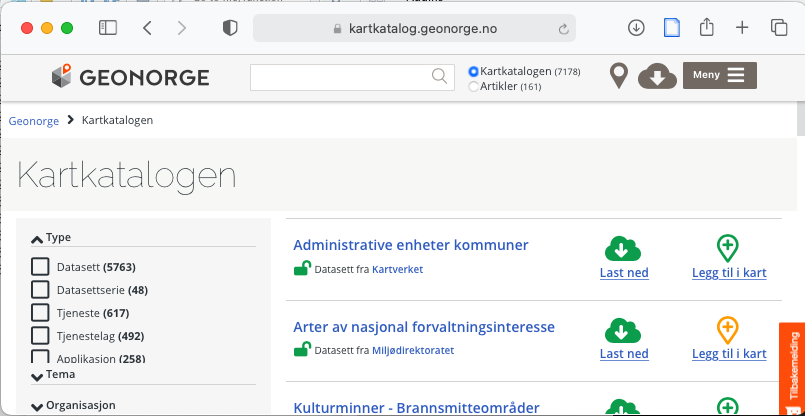
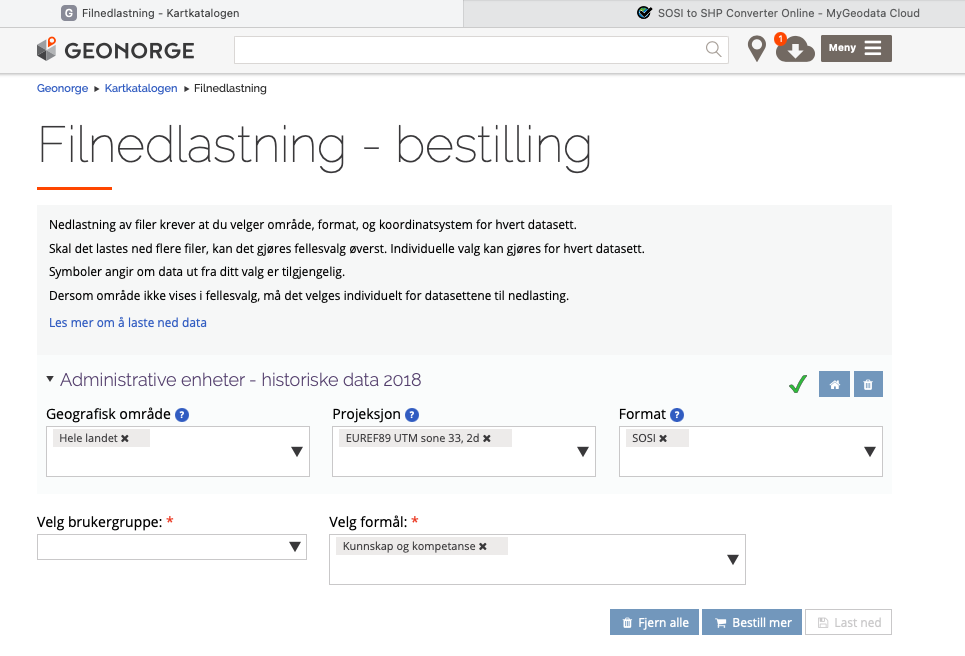
]

---

# Alternatives

- an online alternative is [mygeodata.cloud/converter/sosi-to-shp](https://mygeodata.cloud/converter/sosi-to-shp) to convert from sosi to .shp (did not work late May 2021)
- another alternative is [https://sosicon.espenandersen.no/download/](https://sosicon.espenandersen.no/download/)

---

# SOSI File Converter

.left-column[
- Note, shape format selected
- Select "Create subfolder", use one subfolder per map when you have it in shape format
]
.right-column[
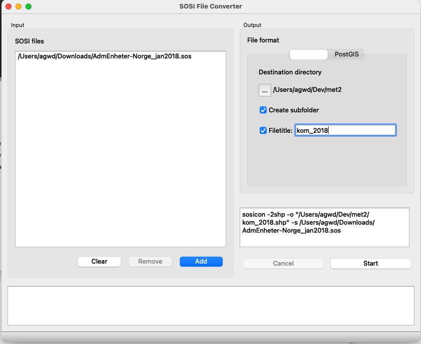
]

---

# Municipality map

- Qgis
- we have got a whole collection of maps, Kommune_FLATE.shp is probably the one we want
- the map has 428 features (here "Kommune")
- A "feature" will be a polygon, line or point with associated data
- The projection of the map is "EPSG:25833" or UTM zone 33N (the recommended projection when we plot the whole of Norway)

---

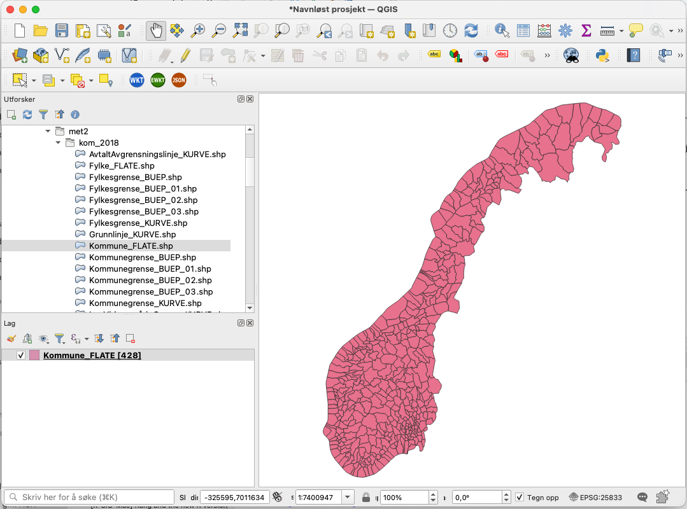

---

# Export list of features

- We export the features as a .csv file
- This gives us the the data associated with each feature (municipality number, name etc.)

---

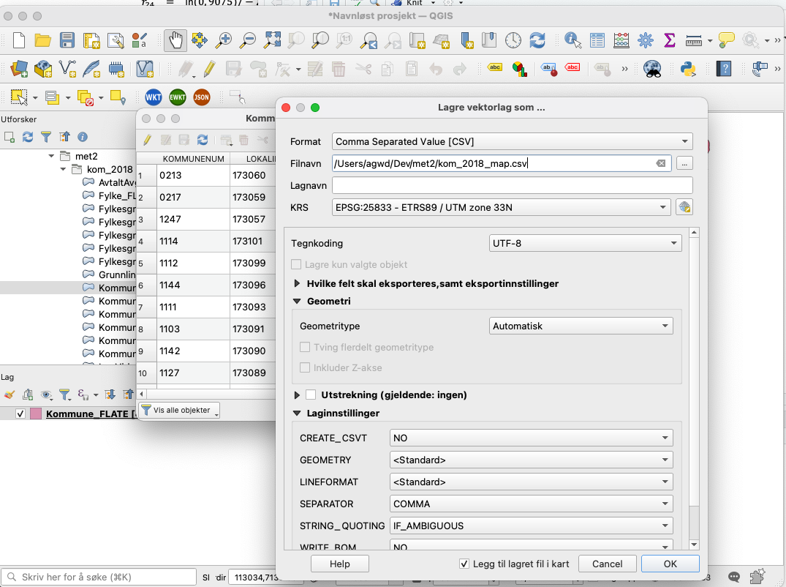

---

## Read feature data into R

```{r}
library(readr)
kom_2018_map <- read_csv("kom_2018_map.csv")
```

- pick what we need

```{r}
kom_2018_map <- kom_2018_map %>% 
  select(KOMMUNENUM,NAVN)

map_knr_2018 <- kom_2018_map$KOMMUNENUM
data_knr_2018 <- sfd_18$knr
# knr in map, but not in data file
setdiff(map_knr_2018,data_knr_2018)
```

- we got "new Trøndelag". Our data uses municipality structure before 2018 to be consistent over time.

---

# 2017 map

.pull-left[
- Do to 2017 what we did with 2018
- pick the variables we need

```{r}
kom_2017_map <- read_csv("kom_2017_map.csv")
kom_2017_map <- kom_2017_map %>% 
  select(KOMMUNENUM,NAVN)
```
]
.pull-right[

- Have we got the same observations in the map as in the data file?

```{r}
map_knr_2017 <- kom_2017_map$KOMMUNENUM
data_knr_2018 <- sfd_18$knr
# in map_knr_2017, but not in data_knr_2018
setdiff(map_knr_2017, data_knr_2018)
```

```{r}
# in data_knr_2018, but not in map_knr_2017
setdiff(data_knr_2018, map_knr_2017)
```

- what municipalities are these?
- [norske kommunenummer](https://no.wikipedia.org/wiki/Norske_kommunenummer)
]

---

- The problematic municipalities
- Taken from: [https://no.wikipedia.org/wiki/Norske_kommunenummer](https://no.wikipedia.org/wiki/Norske_kommunenummer)

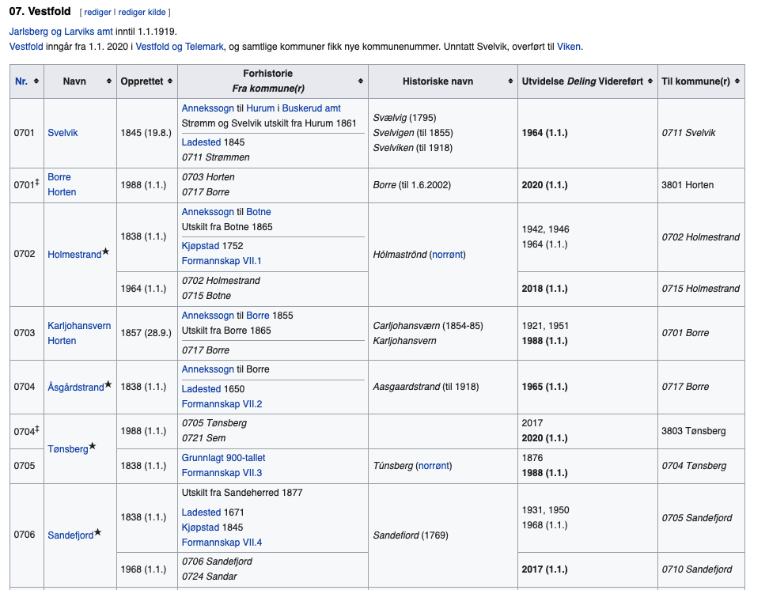

---

# Fix the problem

- In the map we must join 0709 and 0728 into 0712 Larvik
- In the map we must join 0702 + 0714 into 0715 Holmestrand
- In the map we must join 0722 + 0723 into 0729 Færder
- This can be done in R, but we do it first in Qgis.

---

# Qgis dissolve ("Løs opp ...")

.pull-left[
Easiest way:
- First name the polygons
    - right click/crtl click on the map layer 
- Select "Egenskaper" and then "Påskrifter" (4. in the list on the left)
- Then select "Enkle påskrifter" from the drop-down menu at the top, and select KOMMUNENUM as the variable to be used for "påskrift"
- We know that "07" is "Vestfold" county, so we zoom in on the lower right corner
]
.pull-right[
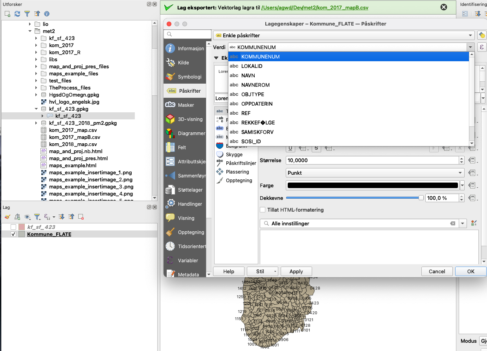
]

---

# Select 0709 and 0728

.pull-left[
- Choose the select tool
- Shift-click on 0728 and 0709
]
.pull-right[
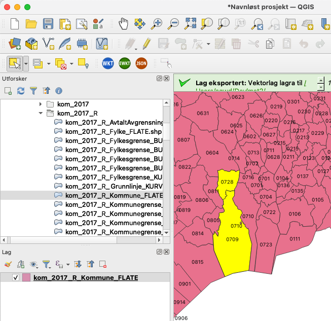
]

---

# Dissolve (union) 0709 and 0728 into 0712 Larvik

.pull-left[
- Dissolve 
]
.pull-right[
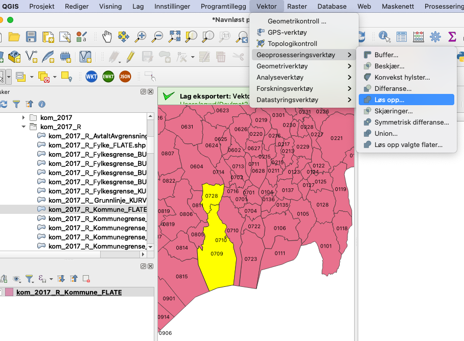
]

---

# Dissolve

.pull-left[
- Important! Select "Kun valgte objekter"
- Let "Oppløst" be "midlertidig lag"
- Click "Kjør", and then "Close"
]
.pull-right[
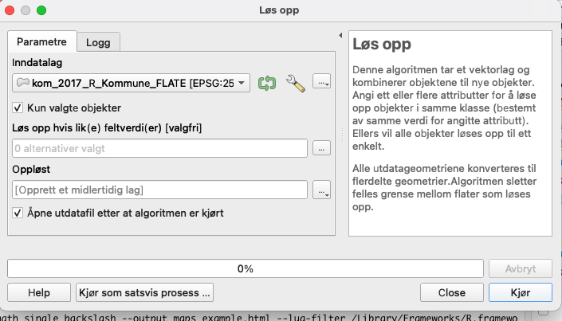
]
---

# Qgis dissolve cont.

.pull-left[
- deselect the "Oppløst" layer
- 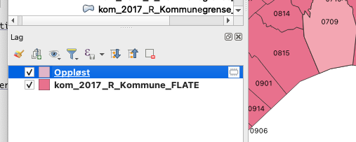
- Click on the map layer and enable editing
- 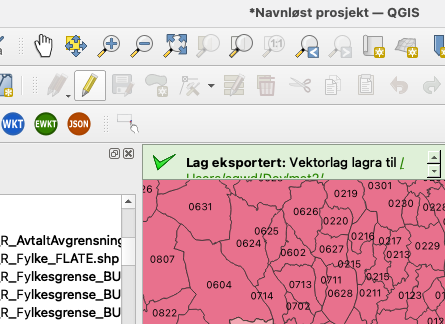


]
.pull-right[
- Delete selection
- 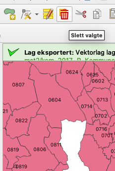
- Change to "Oppløst", select the object
]

---

# Qgis dissolve cont.

.pull-left[
- Copy the object (Rediger > Kopier objekter)
- 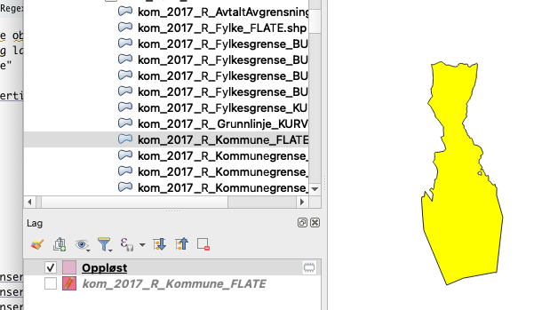
]
.pull-right[
- Change to the other layer and paste the object (Rediger > Lim inn objekter)
- Disable editing, save the map
- 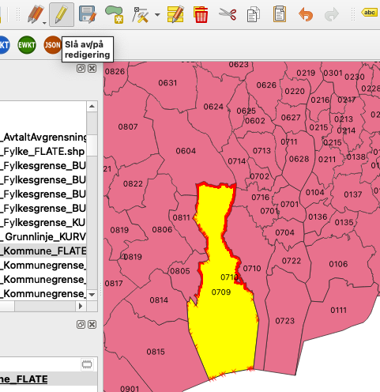
]
---

# Change name of new object

.pull-left[
- Enable editing (Click on the pencil)
- Click on "Identifiser objekter"
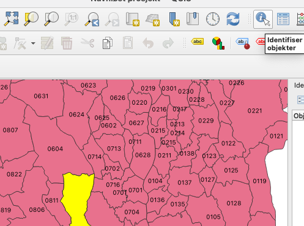
- Click on the new object
- Click on the icon above "Objekt" heading
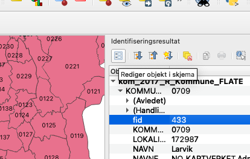
]
.pull-right[
- Change "KOMMUNENUM to 0712
- Name is already "Larvik", so OK
- 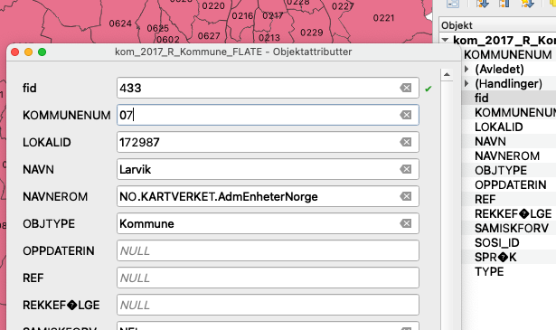
- Click OK
- Disable editing (click the pencil again) and save the map
]

# Do the same for 0715 Holmestrand and 0729 Færder

- Join 0702 + 0714 into 0715 Holmestrand
- Join 07232 + 0723 into 0729 Færder
- Remember to save the map
- Export the finished map as .csv format

# Qgis dissolve cont.

```{r}
kom_2017_mapB <- read_csv("kom_2017_mapB.csv")
kom_2017_mapB <- kom_2017_mapB %>% 
  select(KOMMUNENUM,NAVN)

map_knr_2017B <- kom_2017_mapB$KOMMUNENUM
# in map_knr_2017, but not in data_knr_2018
setdiff(map_knr_2017B, data_knr_2018)
```


```{r}
# in data_knr_2018, but not in map_knr_2017
setdiff(data_knr_2018, map_knr_2017B)
```

- Something wrong?

```{r}
length(data_knr_2018)
length(map_knr_2017B)
```

- No, in the map some municipalities are split on two, or more, polygons
```{r}
length(unique(data_knr_2018))
```

```{r}
length(unique(map_knr_2017B))
```

---

# How to do it in R

- Start with a fresh map (run sosicon again)
- Try with `sf::st_read()`

```{r}
library(sf)
#Sys.setenv("SHAPE_ENCODING"= "UTF-8")
#kom_map <- st_read(dsn = 'kom_2017_R', layer = 'kom_2017_R_Kommune_FLATE')
```

- Gives: 
"Reading layer kom_2017_R_Kommune_FLATE from data source /Users/agwd/Dev/met2/kom_2017_R using driver ESRI Shapefile
Error in make.names(vnames, unique = TRUE) : invalid multibyte string 8
Error during wrapup: invalid multibyte string at <d8>LGE
Error: no more error handlers available (recursive errors?); invoking abort restart"
- seems to be some problem with sosiconv, different character set in variables (Norvegian characters in .dbf) and in the values.

---

# Using sp and rgdal

```{r}
library(rgdal)
kf <- readOGR(dsn = 'kom_2017_R', 
              layer = 'kom_2017_R_Kommune_FLATE', 
              verbose = TRUE, 
              p4s=NULL,  
              drop_unsupported_fields=TRUE, 
              use_iconv = TRUE, 
              encoding = "UTF-8")
```

---

# Using sp and rgdal cont.

```{r}
# Drop some of the variables of no interest to us
head(kf[, c(1:3, length(names(kf)))], n=1)
```


uses ```NA``` and ```NA..1``` as names for the two problematic variables ```REKKEFØLGE``` og ```SPRÅK```
we do not need them, so OK.
What`s important for us is to get the map read into R and also preserve  the right encoding for the municipality names (which might contain Norwegian characters)

---

# Working with the rgdal map

- Pick the two variables we want, KOMMUNENUM and NAVN......
- Change the names
- Plot the map

```{r}
# variable 1 and 3
kf <- kf[,c(1,3)]
names(kf) <- c("knr", "kNavn")
# Too time consuming for the slides
#plot(kf)
```

---

# More work on kf

- Check class

```{r}
class(kf)
```

- Convert to sf object

```{r}
# Tools to convert from sp to sf, and from sf to sp
kf_sf <- st_as_sf(kf)
class(kf_sf)
```

---

# More work on kf cont.

```{r}
dim(kf_sf)
head(kf_sf, n = 2)
```

---

# Merging municipalities

- Select the municipalities that are not merged
- Merge municipalities, for instance 0709 + 0728 to 0712 Larvik
- Put the map together again

```{r}
# not merged
# remember kf_sf works well with the Tidyverse
kf_sf_nm <- kf_sf %>% 
  # not in c()
  filter(!knr %in% c("0709", "0728", "0702", "0714", "0722", "0723"))
dim(kf_sf_nm)
```

---

# Merging municipalities cont.

```{r}
Larvik_0712 <- kf_sf %>% 
  filter(knr %in% c("0709", "0728")) %>% 
  st_union() %>%
  # we have a sfc object (polygon), ned sf data.frame
  st_sf(knr="0712", kNavn="Larvik")  %>% 
  # The geometry clumn has ended up with the name ".",
  # change it back to geometry
  rename("geometry" = ".")

Holmestrand_0715 <- kf_sf %>% 
  filter(knr %in% c("0702", "0714")) %>% 
  st_union() %>%
  st_sf(knr="0715", kNavn="Holmestrand") %>% 
  rename("geometry" = ".")

Faerder_0729 <- kf_sf %>% 
  filter(knr %in% c("0722", "0723")) %>% 
  st_union() %>%
  st_sf(knr="0729", kNavn="Færder") %>% 
  rename("geometry" = ".")
```

---

# Bind the parts together

- we use rbind() to assemble the parts

--

```{r}
kf_sf_new <- rbind(kf_sf_nm, 
                   Larvik_0712, 
                   Holmestrand_0715, 
                   Faerder_0729)
class(kf_sf_new)
head(kf_sf_new)
```

---

# Plot new Vestfold

```{r}
kf_sf_new %>% 
  filter(as.numeric(knr) > 700 & as.numeric(knr) < 800) %>% 
  select(knr) %>% 
  plot(key.pos=3)
```

---

# Merge map and data

- We can do the merge of data and map in Qgis
- Here we do it in R, using `sf` our new toy

```{r}
dim(kf_sf_new)
```

```{r}
dim(sfd_18)
```

- What's wrong

---

# Merge map and data cont.

- Nothing, but som municipalities have multiple polygons

```{r}
kf_sf_new %>% 
  filter(knr == "0710")
```

---

# Merge map and data cont.

.left-column[
- 0710 Sandefjord has an enclave inside 0712 Larvik
]
.right-column[
```{r}
kf_sf_new %>% 
  filter(knr %in% c("0710", "0712")) %>% 
  select(kNavn) %>% 
  plot(key.pos=3)
```
]

---

# Find duplicates (more than one polygon)

```{r}
kf_sf_new %>% 
  filter(duplicated(knr))
```


---

# Plot Malvik

```{r}
kf_sf_new %>% filter(knr %in% c("1663")) %>% select(kNavn) %>% plot(key.pos=4)
```

---

# Make multipolygons

```{r}
kf_sf_423 <- kf_sf_new %>%
  # kNavn unnecessary, but nice trick to carry along the variable
  group_by(knr, kNavn) %>%
  summarise(geometry = st_combine(geometry)) %>% 
  ungroup()

dim(kf_sf_423)
```

---

# Make multipolygons cont.

```{r}
head(kf_sf_423, n=3)
```

---

# Plot 1663 Malvik

```{r}
# Now as MULTIPOLYGON
kf_sf_423 %>% filter(knr %in% c("1663")) %>% select(kNavn) %>% plot(key.pos=4)
```

---

# Færder

```{r}
kf_sf_423 %>% 
  filter(knr %in% c("0729")) %>% 
  select(kNavn) %>% 
  plot(key.pos=1)
```

---

# Finally ready to join

```{r}
kf_sf_423_2018_pm2 <- left_join(x = kf_sf_423, y =  sfd_18, by = "knr")
# Next take a long time
#View(tmp)
head(kf_sf_423_2018_pm2, n = 5)
```

---

# Finally ready to join cont.

```{r}
kf_sf_423_2018_pm2 <- kf_sf_423_2018_pm2 %>% 
  # split knrNavn from sfd_18 into sfd_knr and sfd_kNavn
  separate(knrNavn, into = c("sfd_knr", "sfd_kNavn"), sep = "\\d\\s") %>% 
  # we do not have to specify geometry it`s taken automatically
  select(knr, kNavn, sfd_kNavn, pm2)
```

---

# Finally ready to join cont.

```{r}
head(kf_sf_423_2018_pm2, n = 5)
```


---

# Check that the names are equal

```{r}
kf_sf_423_2018_pm2 %>% 
  filter(!identical(kNavn, sfd_kNavn)) %>% 
  print(n=5)
```

---

# Choose Norvegian names, not official names

- We choose Norvegian names

```{r}
kf_sf_423_2018_pm2 <- kf_sf_423_2018_pm2 %>% 
  # slect Norwegian names, not offical names
  select(knr, sfd_kNavn, pm2) %>% 
  rename(kNavn = sfd_kNavn)
```

---

# Histogram of price per square meter 

- Histogram of price per square meter for single family dwellings in Norwegian municipalities in 2018

```{r, eval=FALSE}
kf_sf_423_2018_pm2 %>% 
  # Remember + not %>% 
  ggplot(aes(pm2)) +
  geom_histogram()
```

---

# Histogram of price per square meter 

- Histogram of price per square meter for single family dwellings in Norwegian municipalities in 2018

```{r, echo=FALSE, eval=TRUE}
kf_sf_423_2018_pm2 %>% 
  # Remember + not %>% 
  ggplot(aes(pm2)) +
  geom_histogram()
```

---

# Log-transform pm2

- Seems like a log-transformation might be appropriate 

```{r}
kf_sf_423_2018_pm2 <- kf_sf_423_2018_pm2 %>% 
  # log default 'natural logarithms, i.e. ln()
  mutate(log_pm2 = log(pm2))
```

---

# Log-transform pm2 cont.

```{r}
kf_sf_423_2018_pm2 %>% 
  # Remember + not %>% 
  ggplot(aes(log_pm2)) +
  geom_histogram()
```

---

# log_pm2 Eastern Norway

```{r, cache=TRUE}
# Take to long to plot, cache it 
kf_sf_423_2018_pm2 %>%
  filter(substr(knr, start = 1, stop = 2) %in% c("01", "02", "03", "06", "07")) %>%
  select(log_pm2) %>%
  plot(key.pos=1)
```

---

# log_pm2 Rogaland

```{r,cache=TRUE}
kf_sf_423_2018_pm2 %>% 
  filter(substr(knr, start = 1, stop = 2) %in% c("11")) %>% 
  select(log_pm2) %>% 
  plot(key.pos=1)
```

---

# Write out map

- Time to write out our map
- By default we are not allowed to overwrite, hence **append=FALSE**

```{r}
# Do not use unless you are forced
st_write(obj = kf_sf_423, dsn = "kf_sf_423", driver = "ESRI Shapefile", append=FALSE)
# use
st_write(obj = kf_sf_423, dsn = "kf_sf_423.gpkg", driver = "GPKG", append=FALSE)
```

- For use with Geoda

```{r}
st_write(obj = kf_sf_423_2018_pm2, dsn = "kf_sf_423_2018_pm2.gpkg", driver = "GPKG", append=FALSE)
```
